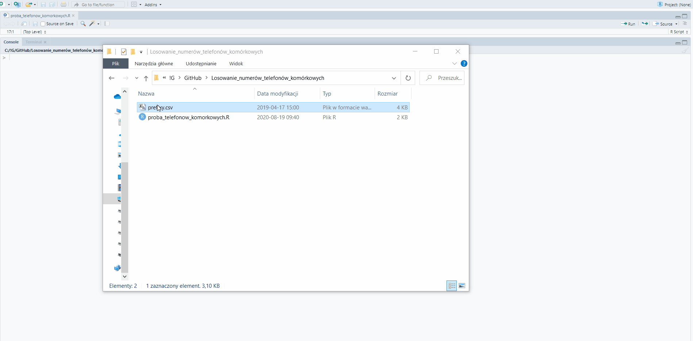

# proba-telefonow-komorkowych
Script for create and random selection of telephone numbers in Poland, base on prefixes publicly available on the Urząd Komunikacji Elektronicznej's websites: https://numeracja.uke.gov.pl/pl/pstn_tables.
User just need to choose the size of sample and then .txt or .csv file where in one cell is one prefix, file with one column and no header. Then user need to choose empty .txt or .csv file where telephone numbers will be written.        

